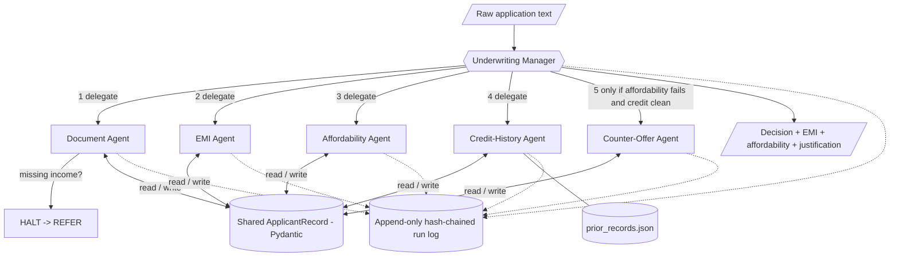

# Architecture diagram (renders on GitHub / VS Code Mermaid preview)

```mermaid
flowchart TD
    IN[/Raw application text/] --> M{{Underwriting Manager}}
    M -- 1 delegate --> D[Document Agent]
    D -- missing income? --> H[HALT -> REFER]
    M -- 2 delegate --> E[EMI Agent]
    M -- 3 delegate --> A[Affordability Agent]
    M -- 4 delegate --> C[Credit-History Agent]
    M -- 5 only if affordability fails and credit clean --> CO[Counter-Offer Agent]
    D & E & A & C & CO <-->|read / write| S[(Shared ApplicantRecord - Pydantic)]
    C --- P[(prior_records.json)]
    M --> OUT[/Decision + EMI + affordability + justification/]
    M & D & E & A & C & CO -.-> L[(Append-only hash-chained run log)]
```
